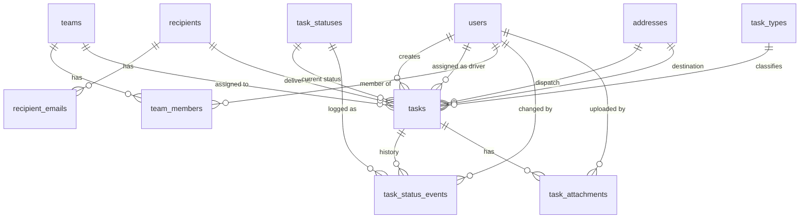

# Database Design (Relational)

Normalized relational schema for Field, derived from the flat task export in [`task-model.md`](task-model.md).

**Master design document:** [`sdd.md`](sdd.md)

**Decisions:**

- **Relational database** — PostgreSQL (local Docker in dev; RDS on AWS in production).
- **Primary keys** — `bigint` identity for internal entities; `uuid` for users (Cognito `sub` for web-authenticated users).
- **Timestamps** — `timestamptz` stored in UTC.
- **Coordinates** — `numeric` latitude/longitude on `addresses` (not comma-separated strings).
- **Sentinel values** — reference system uses `AssignedToTeamId: -1` for unassigned; Field uses `NULL`.

---

## Entity Relationship Overview



---

## Table Groups

| Group | Tables | Purpose |
|-------|--------|---------|
| Identity & access | `users`, `teams`, `team_members` | Creators (web auth), executors (assigned on tasks; mobile has no login) |
| Locations | `addresses` | Reusable pickup and destination sites |
| Contacts | `recipients`, `recipient_emails` | Venues/clients; multiple emails per recipient |
| Task reference data | `task_types`, `task_statuses`, `task_status_transitions` | Lookup values and workflow rules |
| Core | `tasks` | Primary unit of work |
| Task extensions | `task_attachments`, `task_status_events`, `task_documents`, `email_deliveries` | Photos, audit, PDFs, outbound email log |

---

## Identity & Access

### `users`

People who create or execute tasks. Web users authenticate via Cognito; `users.id` = Cognito `sub`. Mobile executors do not log in — user records still exist for assignment and audit, linked via task assignment rather than mobile session.

| Column | Type | Constraints | Maps from reference |
|--------|------|-------------|---------------------|
| `id` | `uuid` | PK | `AssignedToDriverUserId` |
| `display_name` | `varchar(255)` | NOT NULL | `DriverName`, `TaskCreatedBy` |
| `email` | `varchar(255)` | UNIQUE, nullable | — |
| `phone` | `varchar(50)` | nullable | — |
| `role` | `varchar(50)` | NOT NULL | creator, executor, admin, supervisor (expand later) |
| `is_active` | `boolean` | NOT NULL DEFAULT true | — |
| `created_at` | `timestamptz` | NOT NULL | — |
| `updated_at` | `timestamptz` | NOT NULL | — |

**Notes:**

- A user may hold multiple roles over time; MVP uses a single `role` column. Split to `user_roles` if needed later.
- Executors are users with role `executor` (drivers in the reference system).
- **Web:** creators and admins authenticate; actions tied to logged-in user.
- **Mobile:** no login — each executor has a **private build** with `userId` and `displayName` embedded at build time. API and audit fields use this identity on every request.

### Authentication model

| Client | User login | Typical actions |
|--------|------------|-----------------|
| Web | Yes (Cognito) | Create tasks, assign drivers, admin |
| Mobile (Capacitor) | No | Private build with embedded `userId`; view assigned tasks, update status, upload photos |

The `users` table is still required for assignment and web auth. Mobile does not login — identity comes from **build-time embedded config**, sent with each API request.

### `teams`

Crews or dispatch groups. Tasks may be assigned to a team instead of (or in addition to) an individual driver.

| Column | Type | Constraints | Maps from reference |
|--------|------|-------------|---------------------|
| `id` | `bigint` | PK | `AssignedToTeamId` |
| `name` | `varchar(255)` | NOT NULL | — |
| `is_active` | `boolean` | NOT NULL DEFAULT true | — |
| `created_at` | `timestamptz` | NOT NULL | — |
| `updated_at` | `timestamptz` | NOT NULL | — |

### `team_members`

Many-to-many: users belong to one or more teams.

| Column | Type | Constraints |
|--------|------|-------------|
| `team_id` | `bigint` | PK, FK → `teams.id` |
| `user_id` | `uuid` | PK, FK → `users.id` |
| `joined_at` | `timestamptz` | NOT NULL |

---

## Locations

### `addresses`

Normalized pickup (dispatch) and destination locations. Referenced by tasks; optionally reusable across tasks and recipients later.

| Column | Type | Constraints | Maps from reference |
|--------|------|-------------|---------------------|
| `id` | `bigint` | PK | — |
| `street_line` | `varchar(500)` | NOT NULL | `DispatchAddress`, `DestinationAddress` |
| `building` | `varchar(255)` | nullable | `DispatchBuilding`, `DestinationBuilding` |
| `notes` | `text` | nullable | `DispatchNotes`, `DestinationNotes` |
| `latitude` | `numeric(10,7)` | nullable | parsed from `*Coordinates` |
| `longitude` | `numeric(10,7)` | nullable | parsed from `*Coordinates` |
| `created_at` | `timestamptz` | NOT NULL | — |

**Index:** `(latitude, longitude)` if geospatial queries are needed later (PostGIS optional).

---

## Contacts

### `recipients`

Venues, clients, or delivery targets. Master record for repeat destinations.

| Column | Type | Constraints | Maps from reference |
|--------|------|-------------|---------------------|
| `id` | `bigint` | PK | `RecipientId` |
| `name` | `varchar(255)` | NOT NULL | `RecipientName` |
| `phone` | `varchar(50)` | nullable | `RecipientPhone` |
| `default_address_id` | `bigint` | FK → `addresses.id`, nullable | future convenience |
| `is_active` | `boolean` | NOT NULL DEFAULT true | — |
| `created_at` | `timestamptz` | NOT NULL | — |
| `updated_at` | `timestamptz` | NOT NULL | — |

### `recipient_emails`

One recipient may have multiple notification emails (reference stores comma-separated list).

| Column | Type | Constraints | Maps from reference |
|--------|------|-------------|---------------------|
| `id` | `bigint` | PK | — |
| `recipient_id` | `bigint` | FK → `recipients.id`, NOT NULL | — |
| `email` | `varchar(255)` | NOT NULL | `RecipientEmail` (split) |
| `is_primary` | `boolean` | NOT NULL DEFAULT false | — |

**Unique:** `(recipient_id, email)`

---

## Task Reference Data

### `task_types`

| Column | Type | Constraints |
|--------|------|-------------|
| `id` | `smallint` | PK |
| `code` | `varchar(50)` | UNIQUE, NOT NULL |
| `name` | `varchar(100)` | NOT NULL |
| `sort_order` | `smallint` | NOT NULL DEFAULT 0 |

**Seed data (from reference):**

| code | name |
|------|------|
| `delivery` | Delivery |
| `install` | Install |
| `removal` | Removal |
| `site_survey` | Site Survey |
| `other` | Other |

### `task_statuses`

| Column | Type | Constraints |
|--------|------|-------------|
| `id` | `smallint` | PK |
| `code` | `varchar(50)` | UNIQUE, NOT NULL |
| `name` | `varchar(100)` | NOT NULL |
| `sort_order` | `smallint` | NOT NULL DEFAULT 0 |
| `is_terminal` | `boolean` | NOT NULL DEFAULT false |

**Seed data (from reference):**

| code | name | is_terminal | Notes |
|------|------|-------------|-------|
| `created` | Created | false | Initial state |
| `unassigned` | Unassigned | false | No driver/team yet |
| `assigned` | Assigned | false | Driver or team set |
| `loaded` | Loaded | false | Example: en route / loaded on truck |
| `arrived` | Arrived | false | On site |
| `completed` | Completed | true | Success terminal |
| `failed` | Failed | true | Failure terminal |

### `task_status_transitions`

Allowed workflow edges. Enforce in application layer (or DB trigger) when status changes.

| Column | Type | Constraints |
|--------|------|-------------|
| `from_status_id` | `smallint` | PK, FK → `task_statuses.id` |
| `to_status_id` | `smallint` | PK, FK → `task_statuses.id` |

**Draft transition graph** (confirm with business):

```text
created → unassigned | assigned
unassigned → assigned
assigned → loaded | failed
loaded → arrived | failed
arrived → completed | failed
completed → (terminal)
failed → (terminal)
```

Adjust when real workflow rules are confirmed.

---

## Core: `tasks`

Central table. Denormalized display names from the reference (`DriverName`, `RecipientName`) are **not** stored — join related tables in queries/API responses.

| Column | Type | Constraints | Maps from reference |
|--------|------|-------------|---------------------|
| `id` | `bigint` | PK | `Id` |
| `task_type_id` | `smallint` | FK → `task_types.id`, NOT NULL | `TaskType` |
| `status_id` | `smallint` | FK → `task_statuses.id`, NOT NULL | `Status` |
| `description` | `text` | NOT NULL | `TaskDesc` |
| `external_key` | `varchar(100)` | nullable, indexed | `ExternalKey` |
| `created_by_user_id` | `uuid` | FK → `users.id`, NOT NULL | `TaskCreatedBy` (resolved to user) |
| `assigned_driver_user_id` | `uuid` | FK → `users.id`, nullable | `AssignedToDriverUserId` |
| `assigned_team_id` | `bigint` | FK → `teams.id`, nullable | `AssignedToTeamId` (NULL = unassigned) |
| `recipient_id` | `bigint` | FK → `recipients.id`, nullable | `RecipientId` |
| `dispatch_address_id` | `bigint` | FK → `addresses.id`, nullable | `Dispatch*` |
| `destination_address_id` | `bigint` | FK → `addresses.id`, nullable | `Destination*` |
| `crew_size` | `smallint` | nullable | `Guys` |
| `estimated_hours` | `numeric(5,2)` | nullable | `Hours` |
| `is_time_specific` | `boolean` | NOT NULL DEFAULT false | `IsTimeSpecific` |
| `can_install_early` | `boolean` | NOT NULL DEFAULT false | `CanInstallEarly` |
| `window_start_at` | `timestamptz` | nullable | `AfterDateTime` |
| `window_end_at` | `timestamptz` | nullable | `BeforeDateTime` |
| `completed_notes` | `text` | nullable | `CompletedNotes` |
| `completed_at` | `timestamptz` | nullable | `CompletedDateTime` |
| `failed_reason` | `text` | nullable | `TaskFailedReason` |
| `created_at` | `timestamptz` | NOT NULL | `CreatedDateTime` |
| `updated_at` | `timestamptz` | NOT NULL | `ModifiedDateTime` |

**Constraints:**

- `CHECK (window_end_at IS NULL OR window_start_at IS NULL OR window_end_at >= window_start_at)`
- At most one of `assigned_driver_user_id` and `assigned_team_id` may be set, **or** both allowed if business assigns team + lead driver — confirm (default: allow either/both, nullable).

**Indexes:**

- `(status_id, assigned_driver_user_id)` — executor task list
- `(status_id, window_start_at, window_end_at)` — dispatch board / scheduling
- `(recipient_id)`
- `(external_key)` where not null
- `(created_at DESC)`

**Assignment rule (draft):** `assigned` status should require `assigned_driver_user_id` OR `assigned_team_id`. Enforce in service layer.

---

## Task Extensions

### `task_attachments`

Photos, signatures, and other files. Binary content in S3; metadata here.

| Column | Type | Constraints |
|--------|------|-------------|
| `id` | `bigint` | PK |
| `task_id` | `bigint` | FK → `tasks.id`, NOT NULL |
| `uploaded_by_user_id` | `uuid` | FK → `users.id`, NOT NULL |
| `kind` | `varchar(50)` | NOT NULL | `photo`, `signature`, `document` |
| `storage_key` | `varchar(500)` | NOT NULL | S3 object key |
| `mime_type` | `varchar(100)` | NOT NULL | |
| `file_name` | `varchar(255)` | nullable | |
| `file_size_bytes` | `bigint` | nullable | |
| `caption` | `text` | nullable | |
| `created_at` | `timestamptz` | NOT NULL | |

**Index:** `(task_id, created_at)`

### `task_documents`

Server-generated PDFs per task. Binary content in S3; metadata here. See [`critical-features.md`](critical-features.md).

| Column | Type | Constraints |
|--------|------|-------------|
| `id` | `bigint` | PK |
| `task_id` | `bigint` | FK → `tasks.id`, NOT NULL |
| `kind` | `varchar(50)` | NOT NULL | `shipping_label`, `delivery_docket`, `pod` |
| `storage_key` | `varchar(500)` | NOT NULL | S3 object key |
| `file_name` | `varchar(255)` | NOT NULL | e.g. `pod-12056480.pdf` |
| `generated_at` | `timestamptz` | NOT NULL | |
| `generated_by_user_id` | `uuid` | FK → `users.id`, nullable | null if system-generated on status change |

**Unique:** `(task_id, kind)` if only one active PDF per type per task; otherwise version with `generated_at` and no unique constraint.

**Index:** `(task_id, kind)`

### `email_deliveries`

Log of automatic outbound emails. See [`critical-features.md`](critical-features.md).

| Column | Type | Constraints |
|--------|------|-------------|
| `id` | `bigint` | PK |
| `task_id` | `bigint` | FK → `tasks.id`, NOT NULL |
| `trigger` | `varchar(50)` | NOT NULL | e.g. `task_completed`, `task_assigned` |
| `to_addresses` | `text` | NOT NULL | comma-separated or JSON array |
| `subject` | `varchar(500)` | NOT NULL | |
| `status` | `varchar(50)` | NOT NULL | `pending`, `sent`, `failed` |
| `provider_message_id` | `varchar(255)` | nullable | SES message ID |
| `error_message` | `text` | nullable | last failure reason |
| `sent_at` | `timestamptz` | nullable | |
| `created_at` | `timestamptz` | NOT NULL | |

**Index:** `(task_id, created_at)`, `(status)` where pending retry

### `task_status_events`

Append-only audit log for status changes (and optional assignment changes).

| Column | Type | Constraints |
|--------|------|-------------|
| `id` | `bigint` | PK |
| `task_id` | `bigint` | FK → `tasks.id`, NOT NULL |
| `from_status_id` | `smallint` | FK → `task_statuses.id`, nullable |
| `to_status_id` | `smallint` | FK → `task_statuses.id`, NOT NULL |
| `changed_by_user_id` | `uuid` | FK → `users.id`, nullable | system if null |
| `notes` | `text` | nullable | |
| `created_at` | `timestamptz` | NOT NULL | |

**Index:** `(task_id, created_at)`

---

## Flat → Relational Mapping

| Reference field | Relational home |
|-----------------|-----------------|
| `Id` | `tasks.id` |
| `TaskType` | `tasks.task_type_id` → `task_types.code` |
| `Status` | `tasks.status_id` → `task_statuses.code` |
| `TaskDesc` | `tasks.description` |
| `ExternalKey` | `tasks.external_key` |
| `AssignedToDriverUserId` | `tasks.assigned_driver_user_id` → `users` |
| `DriverName` | `users.display_name` (join) |
| `AssignedToTeamId` | `tasks.assigned_team_id` → `teams` (`NULL` if unassigned) |
| `TaskCreatedBy` | `tasks.created_by_user_id` → `users` |
| `Guys` | `tasks.crew_size` |
| `Hours` | `tasks.estimated_hours` |
| `AfterDateTime` / `BeforeDateTime` | `tasks.window_start_at` / `window_end_at` |
| `IsTimeSpecific` / `CanInstallEarly` | `tasks.is_time_specific` / `can_install_early` |
| `Dispatch*` | `tasks.dispatch_address_id` → `addresses` |
| `Destination*` | `tasks.destination_address_id` → `addresses` |
| `RecipientId` / `RecipientName` / `RecipientPhone` | `tasks.recipient_id` → `recipients` |
| `RecipientEmail` | `recipient_emails` (one row per address) |
| `CompletedNotes` / `CompletedDateTime` | `tasks.completed_notes` / `completed_at` |
| `TaskFailedReason` | `tasks.failed_reason` |
| Photos (in `TaskDesc` instructions) | `task_attachments` at completion |
| Generated PDFs | `task_documents` — `shipping_label`, `delivery_docket`, `pod` |
| Automatic emails | `email_deliveries` |
| Status history | `task_status_events` |

---

## API Read Model (example)

Clients receive a denormalized task DTO assembled from joins — similar to the reference export for compatibility:

```typescript
interface TaskReadModel {
  id: number;
  taskType: string;
  status: string;
  description: string;
  externalKey: string | null;
  assignedDriver: { id: string; displayName: string } | null;
  assignedTeam: { id: number; name: string } | null;
  recipient: {
    id: number;
    name: string;
    emails: string[];
    phone: string | null;
  } | null;
  dispatchAddress: AddressDto | null;
  destinationAddress: AddressDto | null;
  crewSize: number | null;
  estimatedHours: number | null;
  windowStartAt: string | null;
  windowEndAt: string | null;
  isTimeSpecific: boolean;
  canInstallEarly: boolean;
  completedNotes: string | null;
  completedAt: string | null;
  failedReason: string | null;
  attachments: TaskAttachmentDto[];
  documents: TaskDocumentDto[]; // shipping_label | delivery_docket | pod
  createdBy: { id: string; displayName: string };
  createdAt: string;
  updatedAt: string;
}
```

---

## Deferred Tables (post-MVP)

Do not build until requirements confirm need:

| Table | Reason deferred |
|-------|-----------------|
| `task_line_items` | Materials embedded in `TaskDesc` today (e.g. "Signs x4") |
| `recipient_addresses` | Link recipients to saved addresses when reuse patterns emerge |
| `task_failure_reasons` | Free-text `failed_reason` sufficient for MVP |
| `user_roles` | Single `role` column on `users` until multi-role is required |

---

## MVP Schema Subset

Minimum tables to support **create → assign → execute (status updates) → complete with photo**:

| Table | MVP |
|-------|-----|
| `users` | Yes |
| `teams` | Optional — include if team assignment is day-one |
| `team_members` | Optional |
| `recipients` | Yes — if tasks reference repeat venues; else inline destination only |
| `recipient_emails` | Yes if `recipients` included |
| `addresses` | Yes |
| `task_types` | Yes (seed) |
| `task_statuses` | Yes (seed) |
| `task_status_transitions` | Optional — can hardcode in app for MVP |
| `tasks` | Yes |
| `task_attachments` | Yes — photo proof on completion |
| `task_documents` | Yes — PDF label, docket, POD |
| `email_deliveries` | Yes — automatic email log |
| `task_status_events` | Recommended — cheap audit trail |

**MVP simplification option:** Skip `recipients` master table initially; store destination on `addresses` only and leave `recipient_id` null. Add `recipients` when venue reuse matters.

---

## Deployment placement

**Local development (current):** All development is local until the user specifies AWS integration. See [`sdd.md`](sdd.md) Section 2.3 and 11.1.

| Component | Local dev | Production target (AWS) |
|-----------|-----------|-------------------------|
| Database | PostgreSQL (Docker Compose) | Amazon RDS for PostgreSQL |
| File blobs | `./storage/` filesystem | S3 — `task_attachments`, `task_documents` |
| Email | Console / Mailpit | Amazon SES — `email_deliveries` |
| Auth | Local dev auth stub | Cognito — web only; `users.id` = Cognito `sub` |

Use storage and email abstractions so `storage_key` works for both local paths and S3 keys.

---

## Open Questions

- Confirm status transition rules with operations team
- PDF generation triggers per document type (label, docket, POD)
- Email triggers and templates per task event
- Per-executor build and distribution process
- Whether to embed a mobile API token per build (recommended for production)
- Team vs driver assignment: mutually exclusive or both?
- Is `recipients` master data required for MVP, or destination-only tasks enough?
- Unique constraint on `external_key` (per integration source)?
- Soft-delete pattern (`deleted_at`) on tasks and users?
- Timezone display: store UTC only; client converts?
