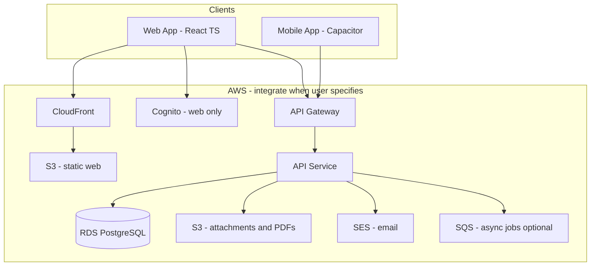
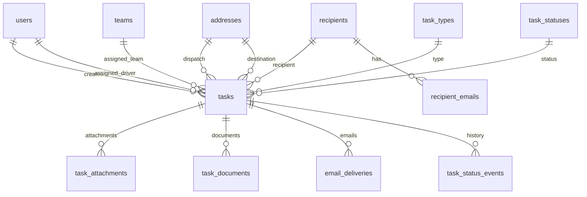

# Software Design Document (SDD)

**Project:** Field  
**Version:** 0.3 (draft)  
**Status:** Build (started) — web shell + Tasks page  
**Last updated:** 2026-07-15

---

## 1. Introduction

### 1.1 Purpose

This document describes the software design for **Field**, a field workforce management (FWM) application. It consolidates decisions captured in pre-design work and defines the architecture, domain model, and implementation boundaries sufficient to begin building.

### 1.2 Scope

Field mirrors and will eventually replace a third-party FWM product the organization currently licenses. The system supports:

- Creating and assigning **tasks** (web, authenticated)
- Executing tasks in the field (mobile, no login)
- Generating **PDF documents** (shipping label, delivery docket, proof of delivery)
- **Automatic email** delivery tied to task events

Out of scope for this SDD: detailed UI mockups, PDF template layouts, production AWS provisioning runbooks, and licensed-product vendor identification.

### 1.3 Audience

Engineers, architects, and AI agents implementing Field. For agent quick-reference, see [`../AGENTS.md`](../AGENTS.md).

### 1.4 Related documents

| Document | Contents |
|----------|----------|
| [`AGENTS.md`](../AGENTS.md) | Agent onboarding, decisions summary, open questions |
| [`task-model.md`](task-model.md) | Reference task export from licensed system |
| [`database-design.md`](database-design.md) | Full relational schema, indexes, MVP table subset |
| [`critical-features.md`](critical-features.md) | PDF generation and automatic email requirements |

---

## 2. Goals and constraints

### 2.1 Business goals

1. Ship a **minimum functioning product** that supports real delivery workflows.
2. Achieve **functional parity** with the licensed FWM product over time — mirror before innovate.
3. Reduce licensing dependency by owning the stack on **AWS**.

### 2.2 Design constraints

| Constraint | Decision |
|------------|----------|
| Primary domain unit | **Task** — creators create; executors execute |
| Feature discipline | MVP-first; avoid feature creep |
| Web platform | React + TypeScript, mobile-responsive |
| Mobile platform | Capacitor (iOS/Android), same codebase, **private distribution** |
| Web auth | **Required** — local stub in dev; **Amazon Cognito** in production |
| Mobile auth | **None at runtime** — identity embedded in private per-executor build |
| Database | **PostgreSQL** — local in dev; RDS on AWS in production |
| Hosting | **Local dev now**; **AWS** when user integrates |

### 2.3 Development environment (local-first)

**Until the user specifies otherwise, all development is local.** Do not provision AWS, deploy cloud resources, or integrate Cognito, RDS, S3, or SES.

| Concern | Local (current) | Production target (AWS, later) |
|---------|-----------------|--------------------------------|
| Database | PostgreSQL (Docker Compose or native) | RDS PostgreSQL |
| API | `localhost` | API Gateway + ECS/Lambda |
| Web app | Vite dev server | S3 + CloudFront |
| Files / PDFs | Local `./storage` directory | S3 |
| Web auth | Dev auth stub or simple JWT | Cognito |
| Email | Console, file, or Mailpit | SES |

Use **provider abstractions** (storage, email, auth) so AWS can be swapped in without rewriting business logic. Agents must not run AWS deploys or create cloud resources unless the user explicitly requests integration.

### 2.4 Critical features (non-negotiable)

These are in scope for MVP pipeline validation, not post-launch add-ons:

1. **PDF generation** — shipping label, delivery docket, POD
2. **Automatic email** — event-driven, logged, retryable

See [`critical-features.md`](critical-features.md).

---

## 3. System overview

### 3.1 Context diagram (production target)

The diagram below is the **target production architecture on AWS**. During local development, components map to localhost equivalents — see Section 2.3.



### 3.2 User roles

| Role | Client | Auth | Primary actions |
|------|--------|------|-----------------|
| **Task creator** | Web | Yes (local / Cognito) | Create tasks, assign drivers/teams, view dispatch |
| **Dispatcher / admin** | Web | Yes (local / Cognito) | Manage tasks, users, documents, emails |
| **Task executor** (driver) | Mobile (Capacitor) | Embedded in private build | View assigned tasks, update status, capture photos, complete |

Each executor receives a **private Capacitor build** with their `userId` and `displayName` embedded at build time. The API scopes mobile requests to that user and populates audit fields — no runtime login.

### 3.3 Core workflow

```text
┌─────────────┐     ┌──────────────┐     ┌─────────────┐     ┌──────────────┐
│ Create task │ ──► │ Assign driver│ ──► │ Execute in  │ ──► │ Complete +   │
│   (web)     │     │   / team     │     │ field (mob) │     │ photos (mob) │
└─────────────┘     └──────────────┘     └─────────────┘     └──────────────┘
       │                    │                    │                    │
       ▼                    ▼                    ▼                    ▼
  task created         status: assigned      status: loaded/      status: completed
                       docket PDF (TBD)      arrived              POD PDF + email
```

Side effects (PDF generation, email) hook into **status transitions** and completion. Exact triggers are TBD — see Section 8.

---

## 4. Architecture

### 4.1 Style

- **Single-page web application** (React) talking to a **REST API** (backend framework TBD).
- **Monolithic API** for MVP — one deployable service with clear modules (tasks, documents, email, auth middleware).
- **Async workers** (optional SQS + Lambda or in-process queue) for PDF generation and email so task updates are not blocked.

### 4.2 Client architecture

One React + TypeScript codebase with **runtime branching**:

```text
┌─────────────────────────────────────────────────────────┐
│                  React + TypeScript App                  │
├─────────────────────────┬───────────────────────────────┤
│   Browser (web)         │   Capacitor shell (mobile)    │
│   - Login (local/Cognito)│   - No login                  │
│   - Full creator UI     │   - Executor UI only          │
│   - Auth-gated routes   │   - Embedded userId per build │
└─────────────────────────┴───────────────────────────────┘
```

Detect environment via Capacitor API (`Capacitor.isNativePlatform()`). On mobile, load **executor config** baked in at build time (Vite env vars or bundled JSON).

### 4.3 API access patterns

| Pattern | Client | Authentication | Endpoints (examples) |
|---------|--------|----------------|----------------------|
| **Web API** | Browser | JWT (local dev auth or Cognito) | CRUD tasks, assign, admin, download PDFs |
| **Mobile API** | Capacitor | Embedded build identity (+ optional API token) | List/update **own** assigned tasks, upload photos |

Mobile requests send embedded `userId` (e.g. `X-Executor-User-Id` header). API returns only tasks where `assigned_driver_user_id` matches. Optionally validate an embedded per-build API token. Do not expose mobile write endpoints without this scoping.

### 4.4 Recommended backend (proposal)

Not finalized. Recommended MVP stack for AWS alignment:

| Layer | Proposal | Rationale |
|-------|----------|-----------|
| API runtime | **Node.js** on ECS Fargate or Lambda + API Gateway | TypeScript shared types with frontend; good PDF/email library ecosystem |
| ORM / migrations | **Drizzle** or **Prisma** | Type-safe PostgreSQL access |
| PDF | **PDFKit** or HTML → PDF (Puppeteer on Fargate) | Template-based label/docket/POD |
| Email | **AWS SDK → SES** | Native integration |

Decision deferred to implementation kickoff.

---

## 5. Domain model

### 5.1 Task-centric model

Everything supports the task lifecycle:

```text
create → assign → execute → complete | fail
```

### 5.2 Task types (seed data)

| Code | Name |
|------|------|
| `delivery` | Delivery |
| `install` | Install |
| `removal` | Removal |
| `site_survey` | Site Survey |
| `other` | Other |

### 5.3 Task statuses (seed data)

| Code | Name | Terminal |
|------|------|----------|
| `created` | Created | No |
| `unassigned` | Unassigned | No |
| `assigned` | Assigned | No |
| `loaded` | Loaded | No |
| `arrived` | Arrived | No |
| `completed` | Completed | Yes |
| `failed` | Failed | Yes |

### 5.4 Status transitions (draft)

```text
created       → unassigned | assigned
unassigned    → assigned
assigned      → loaded | failed
loaded        → arrived | failed
arrived       → completed | failed
completed     → (terminal)
failed        → (terminal)
```

Confirm with operations before enforcing in code.

### 5.5 Key entities

| Entity | Purpose |
|--------|---------|
| `users` | Creators, executors, admins; web auth via Cognito |
| `teams` / `team_members` | Optional crew grouping |
| `recipients` / `recipient_emails` | Venues/clients; multiple emails |
| `addresses` | Dispatch (pickup) and destination locations |
| `tasks` | Core work unit |
| `task_attachments` | Photos, signatures (S3) |
| `task_documents` | Generated PDFs (S3) |
| `email_deliveries` | Outbound email audit log |
| `task_status_events` | Status change history |

Full column definitions: [`database-design.md`](database-design.md).

### 5.6 Reference mapping

The licensed system exports a flat task record (example: delivery #12056480, status `Loaded`). Field normalizes this into related tables. Notable mappings:

- `TaskDesc` → `tasks.description` (rich executor instructions, door codes, photo requirements)
- `Destination*` → `addresses` via `destination_address_id`
- `Dispatch*` → optional; null for delivery-only tasks
- `RecipientEmail` (comma-separated) → `recipient_emails` rows
- `DriverName` → join `users.display_name` (not stored on task)

Reference export: [`task-model.md`](task-model.md).

---

## 6. Data design

### 6.1 Database

- **Engine:** PostgreSQL 15+
- **Local dev:** Docker Compose or native PostgreSQL on developer machine
- **Production target:** Amazon RDS
- **Keys:** `bigint` identity for most tables; `uuid` for `users.id` (= auth subject; Cognito `sub` in production)
- **Timestamps:** `timestamptz`, UTC
- **Coordinates:** `numeric(10,7)` lat/lng on `addresses`

### 6.2 Entity relationship (summary)



### 6.3 API read model

The API assembles a denormalized DTO for clients (similar to the licensed export shape):

```typescript
interface TaskReadModel {
  id: number;
  taskType: string;
  status: string;
  description: string;
  externalKey: string | null;
  assignedDriver: { id: string; displayName: string } | null;
  assignedTeam: { id: number; name: string } | null;
  recipient: { id: number; name: string; emails: string[]; phone: string | null } | null;
  dispatchAddress: AddressDto | null;
  destinationAddress: AddressDto | null;
  crewSize: number | null;
  estimatedHours: number | null;
  windowStartAt: string | null;
  windowEndAt: string | null;
  isTimeSpecific: boolean;
  canInstallEarly: boolean;
  completedNotes: string | null;
  completedAt: string | null;
  failedReason: string | null;
  attachments: TaskAttachmentDto[];
  documents: TaskDocumentDto[];
  createdBy: { id: string; displayName: string };
  createdAt: string;
  updatedAt: string;
}
```

### 6.4 File storage

| Environment | Attachments & PDFs | Referenced by |
|-------------|-------------------|---------------|
| **Local dev** | `./storage/attachments`, `./storage/documents` | `storage_key` (relative path) |
| **Production (AWS)** | S3 bucket(s) | `storage_key` (S3 object key) |

Use a storage abstraction interface. Local: direct file read/write or local HTTP. Production: presigned S3 URLs. Do not serve files publicly without auth checks.

---

## 7. Authentication and security

### 7.1 Web authentication

- **Local dev:** Simple auth stub — hardcoded dev users, local JWT, or session cookie. `users.id` can be seeded UUIDs.
- **Production target:** Amazon Cognito User Pool — `users.id` = token `sub`
- **Flow:** SPA login → JWT → API validates on each request
- **User sync:** On login, create or update `users` row

### 7.2 Mobile (embedded identity — no login)

Each executor gets a **private build** distributed internally (MDM, sideload). Identity is **embedded at build time**, not entered at runtime.

**Embedded config (per build):**

```typescript
interface ExecutorBuildConfig {
  userId: string;           // UUID — matches users.id
  displayName: string;      // shown in app header
  apiBaseUrl: string;       // API endpoint
  mobileApiToken?: string;  // optional — validates build authenticity
}
```

**Build approach:**

- Vite build with per-executor env (e.g. `VITE_EXECUTOR_USER_ID`, `VITE_EXECUTOR_NAME`) or generated `executor.config.json` copied into the bundle before `cap sync`.
- One IPA/APK (or build profile) per driver — not a shared generic mobile app.
- No Cognito, login screens, or session storage in Capacitor builds.

**API behavior:**

- Mobile middleware reads embedded identity from request headers (set by the app from build config).
- Scope all mobile queries to `assigned_driver_user_id = userId`.
- Set `changed_by_user_id` and `uploaded_by_user_id` from embedded `userId`.
- Reject status updates on tasks not assigned to that driver.

### 7.3 Authorization (draft)

| Action | Web (authenticated) | Mobile (embedded identity) |
|--------|---------------------|----------------------------|
| Create / edit tasks | Creator, admin | Deny |
| Assign driver | Creator, admin | Deny |
| View assigned tasks | Any authenticated | Own assignments only (`userId`) |
| Update task status | Creator, assigned executor | Own assignments only |
| Upload photos | Assigned executor | Own assignments only |
| Download PDFs | Authenticated | Own task PDFs |

Implement role checks in API middleware for web routes. Mobile routes validate embedded identity and enforce assignment scoping.

### 7.4 Security considerations

- Each private build is tied to one `userId` — treat builds like credentials; do not share across drivers
- Consider embedding a per-build `mobileApiToken` so API can reject requests without valid token
- Validate status transitions server-side; do not trust client state
- Sanitize PDF/email template inputs
- SES domain verification and SPF/DKIM before production email (not needed for local Mailpit/console)

---

## 8. Critical features

### 8.1 PDF document generation

| Document | Kind code | Typical trigger (TBD) |
|----------|-----------|------------------------|
| Shipping label | `shipping_label` | Status → `loaded` |
| Delivery docket | `delivery_docket` | Status → `assigned` |
| POD | `pod` | Status → `completed` |

**Pipeline:**

```text
Task event → API enqueues job → PDF generator reads task + attachments
    → writes PDF to storage → inserts task_documents row
```

POD incorporates `completed_notes`, `completed_at`, and `task_attachments` (photos).

### 8.2 Automatic email

**Pipeline:**

```text
Task event → API creates email_deliveries (pending) → email provider send
    → update status (sent | failed) → retry on failure
```

**Local dev:** log email body to console, write to file, or use Mailpit. **Production:** Amazon SES.

**Data sources:** `recipient_emails`, task fields, links to PDFs.

**Draft trigger matrix** (confirm with operations):

| Event | Email purpose |
|-------|---------------|
| Task assigned | Internal / driver notification |
| Task loaded | Warehouse / dispatch |
| Task completed | POD or completion notice to recipient |
| Task failed | Alert creator or recipient |

### 8.3 MVP bar for documents and email

Before considering the pipeline complete:

1. At least **one PDF type** generating from real task data
2. At least **one automatic email** on a defined event
3. All outputs logged in `task_documents` / `email_deliveries`

---

## 9. API design (high-level)

Backend framework and OpenAPI spec are **not yet written**. Planned resource groups:

### 9.1 Web endpoints (JWT required)

| Group | Operations |
|-------|------------|
| `/tasks` | List, create, get, update, assign |
| `/tasks/:id/status` | Transition status (with validation) |
| `/tasks/:id/documents` | List, generate, download PDFs |
| `/users` | List executors, manage (admin) |
| `/recipients` | CRUD recipients and emails |

### 9.2 Mobile endpoints (no JWT; protected TBD)

| Group | Operations |
|-------|------------|
| `/mobile/tasks` | List tasks assigned to embedded `userId` |
| `/mobile/tasks/:id` | Get task detail (403 if not assigned to caller) |
| `/mobile/tasks/:id/status` | Update status (assigned tasks only) |
| `/mobile/tasks/:id/attachments` | Upload photo (presigned URL flow) |

All mobile endpoints require embedded identity headers from the private build.

### 9.3 Shared conventions

- JSON request/response bodies
- ISO 8601 timestamps in UTC
- `409 Conflict` on invalid status transition
- Pagination on list endpoints (`cursor` or `offset` — decide at implementation)
- Errors: `{ "error": string, "code": string }`

---

## 10. Client applications

### 10.1 Web application

- **Stack:** React 18+, TypeScript, Vite, React Router, lucide-react
- **Scaffold status:** Underway — app shell (hamburger + left nav) and **Tasks** page with mock data grid; auth and API not wired yet
- **Auth:** Local dev login (production: Cognito hosted UI or embedded login)
- **Views (MVP):** Login, task list/board, task create/edit, task detail, assign driver, PDF download
- **Responsive:** Mobile-first shell; usable on phone through desktop

### 10.2 Mobile application (Capacitor)

- **Stack:** Same React build inside Capacitor 6+
- **Plugins (anticipated):** Camera, Filesystem, optional Push Notifications
- **Views (MVP):** Task list (assigned), task detail, status actions, camera capture
- **Distribution:** One **private build per executor** — identity embedded at build time; MDM or sideload
- **No auth UI** — app opens directly to that driver's task list

### 10.3 Build and release flow

**Web (shared build):**

```text
1. npm run dev             → Vite dev server (local)
2. npm run build           → web assets for creators/dispatch
```

**Mobile (per-executor private build):**

```text
1. Set executor env       → VITE_EXECUTOR_USER_ID, VITE_EXECUTOR_NAME, optional token
2. npm run build:mobile   → Capacitor bundle with embedded config
3. npx cap sync           → copy into iOS/Android project
4. Build IPA/APK          → distribute to that driver only (MDM / sideload)
5. Repeat                 → one build per executor
```

For local dev, use a single `.env.mobile.local` with a test executor UUID. Automate step 1–4 with a build script when driver count grows.

AWS deploy (S3/CloudFront for web) happens only when the user directs integration.

---

## 11. Infrastructure

### 11.1 Local development (current)

All work happens on the developer machine until the user specifies AWS integration:

| Component | Local setup |
|-----------|-------------|
| Database | PostgreSQL via Docker Compose (`docker compose up`) |
| API | Node process on `localhost:3000` (port TBD) |
| Web | Vite on `localhost:5173` |
| Storage | `./storage/` directory |
| Email | Console log or Mailpit |
| Auth | Dev user seed + local JWT |

Provide a `docker-compose.yml` for PostgreSQL (and optionally Mailpit). Include `.env.example` for local configuration.

### 11.2 AWS (production target — integrate when user specifies)

Do not provision until requested.

| Component | Service | Notes |
|-----------|---------|-------|
| Static web hosting | S3 + CloudFront | React SPA |
| API | API Gateway + ECS Fargate *(or Lambda)* | TBD |
| Database | RDS PostgreSQL | Single-AZ for MVP; Multi-AZ for prod |
| Auth | Cognito | Web only |
| Object storage | S3 | Attachments + PDFs |
| Email | SES | Verified sending domain |
| Async jobs | SQS + Lambda *(optional)* | PDF/email offload |
| Secrets | Secrets Manager | DB creds, API keys |
| DNS / TLS | Route 53 + ACM | Custom domain |

### 11.3 Environments

| Environment | Purpose |
|-------------|---------|
| `dev` | Local machine + Docker PostgreSQL |
| `staging` | AWS pre-production (when integrated) |
| `prod` | AWS live (when integrated) |

Infrastructure as Code (CDK or Terraform) — adopt when moving to AWS, not for initial local setup.

### 11.4 AWS MVP stack (when integrating)

Start with: RDS PostgreSQL, S3, Cognito, SES, one API compute target, CloudFront + S3 for web. Add SQS when PDF/email async is implemented.

---

## 12. MVP scope

### 12.1 In scope

| Area | MVP deliverable |
|------|-----------------|
| Web auth | Local dev login (Cognito when on AWS) |
| Tasks | Create, assign, list, view, status updates |
| Mobile | Executor task list, status update, photo upload (Capacitor) |
| Data | Core tables per [`database-design.md`](database-design.md) MVP subset |
| PDF | At least one type (recommend: **delivery docket** first) |
| Email | At least one automatic send (recommend: **completion → recipient**) |
| Audit | `task_status_events`, `email_deliveries` logging |

### 12.2 Explicitly deferred

| Item | Reason |
|------|--------|
| `task_line_items` | Materials in `description` text for now |
| `recipient_addresses` | Add when venue reuse patterns emerge |
| Public app store mobile release | Private distribution only |
| SMS notifications | Email only for now |
| Offline-first mobile | Not required unless requirements change |
| Integrations (payroll, CRM, GPS) | Post-MVP |

### 12.3 Suggested implementation order

1. **Foundation** — repo scaffold, Docker PostgreSQL, schema migrations, local auth stub, API health
2. **Task CRUD (web)** — create, list, view, assign
3. **Status workflow** — transitions + `task_status_events`
4. **Mobile executor flow** — Capacitor build, task list, status, photo upload
5. **PDF pipeline** — one template, local `./storage/documents`
6. **Email pipeline** — one trigger, local console/Mailpit
7. **Remaining PDFs and email triggers** — expand matrix
8. **AWS integration** — when user specifies; swap providers (S3, SES, Cognito)

Implement **vertical slices** (UI → API → DB → storage) per step, not horizontal layers.

---

## 13. Non-functional requirements

| Requirement | Target (MVP) |
|-------------|--------------|
| Availability | Best effort; single region |
| Performance | Task list < 2s on mobile LTE |
| Data durability | Local: Docker volume; AWS: RDS backups + S3 |
| Timezone | Store UTC; display in local TZ on client |
| Browser support | Latest Chrome, Edge, Safari |
| Mobile OS | Current iOS and Android (Capacitor supported versions) |

---

## 14. Risks and open issues

### 14.1 Open issues (must resolve during build)

| # | Issue | Impact |
|---|-------|--------|
| O1 | Per-executor build pipeline (script/CI) | Operations |
| O2 | Embed `mobileApiToken` per build? | Security |
| O3 | PDF/email trigger matrix | Feature completeness |
| O4 | PDF template layouts | Document quality |
| O5 | Backend runtime choice (Lambda vs ECS) | DevOps |
| O6 | Status transition confirmation | Business logic |
| O7 | `recipients` master table required for MVP? | Schema scope |
| O8 | Licensed product name/vendor | Parity validation |

### 14.2 Risks

| Risk | Mitigation |
|------|------------|
| Single codebase web/mobile diverges in behavior | Strict runtime detection; shared components; separate route configs |
| Unauthenticated mobile API abused | Per-build identity + optional token; scope to assigned tasks; rate limiting |
| PDF/email blocks task updates | Async queue from day one |
| Scope creep beyond licensed parity | Task-first scoping rule; SDD change control |
| Capacitor limits (offline, native UX) | Document tradeoffs; revisit React Native only if required |

---

## 15. Document history

| Version | Date | Author | Changes |
|---------|------|--------|---------|
| 0.1 | 2026-07-15 | — | Initial SDD synthesized from pre-design docs |
| 0.2 | 2026-07-15 | — | Local-first development; AWS deferred until user specifies |
| 0.3 | 2026-07-15 | — | Mobile: per-executor private builds with embedded identity |

---

## Appendix A: Glossary

| Term | Definition |
|------|------------|
| **Task** | Unit of field work — created by office staff, executed by drivers |
| **Executor** | Field worker (driver) who performs a task |
| **POD** | Proof of delivery — PDF documenting completion |
| **Docket** | Delivery instruction packet for the driver |
| **Recipient** | Venue or client receiving delivery |
| **Capacitor** | Native shell wrapping the web app for iOS/Android |
